# 小遥配配

> AI 对话式电脑导购，帮你 24 小时接单

[](https://opensource.org/licenses/MIT)
[](https://www.python.org/)
[](https://vuejs.org/)
[](https://fastapi.tiangolo.com/)

[English](README_EN.md) | 简体中文

<p align="center">
  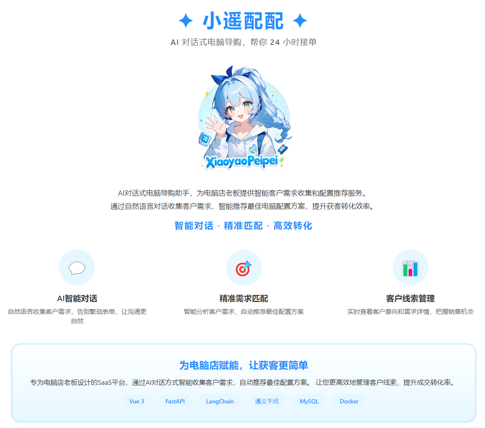
</p>

---

## 简介

<p align="center">
  
</p>

小遥配配是一个 **AI 对话式电脑导购助手**，为电脑店老板提供智能客户需求收集和配置推荐服务的 SaaS 平台，通过 AI 对话方式收集客户需求，智能推荐合适的电脑配置方案。

**核心特点**：
- 🤖 **AI 智能对话** - 自然语言交互，自动识别客户需求意图
- 🎯 **精准配置推荐** - 基于需求自动匹配最佳电脑配置方案
- 📊 **客户线索管理** - 自动收集客户联系方式，不错过任何一个潜在客户
- 📈 **数据统计分析** - 实时查看营销数据和转化效果，优化经营决策
- 🚀 **快速部署** - 前后端分离架构，易于部署和扩展
- 💻 **双端支持** - B 端商家后台 + C 端客户对话界面
- 📱 **响应式设计** - 支持桌面端和移动端访问

---

## 作者介绍

<p align="center">
  
</p>

<p align="center">
  <b>dtsola</b> — IT解决方案架构师 | 一人公司实践者
</p>

<p align="center">
  🌐 <a href="https://www.dtsola.com">个人站点</a> &nbsp;|&nbsp;
  📺 <a href="https://space.bilibili.com/736015">B站</a> &nbsp;|&nbsp;
  💬 微信：dtsola（与我建联，备注：github）
</p>

<p align="center">
  
  &nbsp;&nbsp;&nbsp;&nbsp;&nbsp;&nbsp;
  
  &nbsp;&nbsp;&nbsp;&nbsp;&nbsp;&nbsp;
  
</p>

<p align="center">
  <small>微信联系 &nbsp;&nbsp;&nbsp;&nbsp;&nbsp;&nbsp;&nbsp;&nbsp; 开发者交流群 &nbsp;&nbsp;&nbsp;&nbsp;&nbsp;&nbsp;&nbsp;&nbsp; 用户交流群</small>
</p>

---

## 功能预览

### C端 - 智能对话，获取推荐

#### 对话首页 - 自然语言交互

<table>
<tr>
<td width="50%">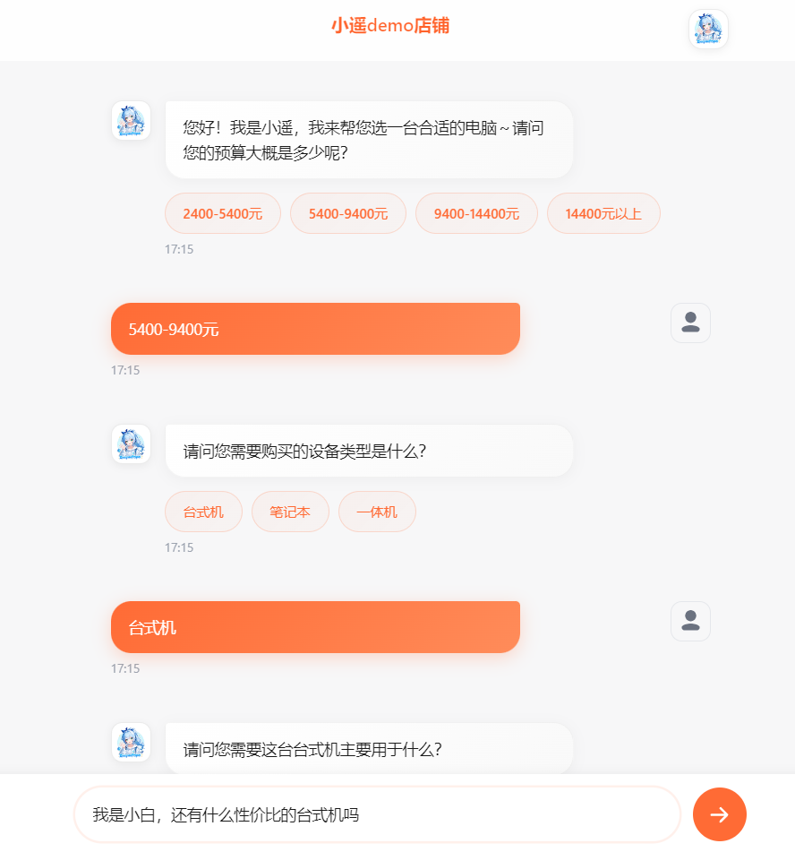</td>
<td width="50%">
<ul>
<li>🎯 自然语言对话，轻松表达需求</li>
<li>🤖 AI 自动识别需求意图</li>
<li>⚡ 实时响应，流畅交互体验</li>
<li>💬 支持多轮对话，逐步细化需求</li>
</ul>
</td>
</tr>
</table>

#### 配置推荐 - 智能匹配方案

<table>
<tr>
<td width="50%">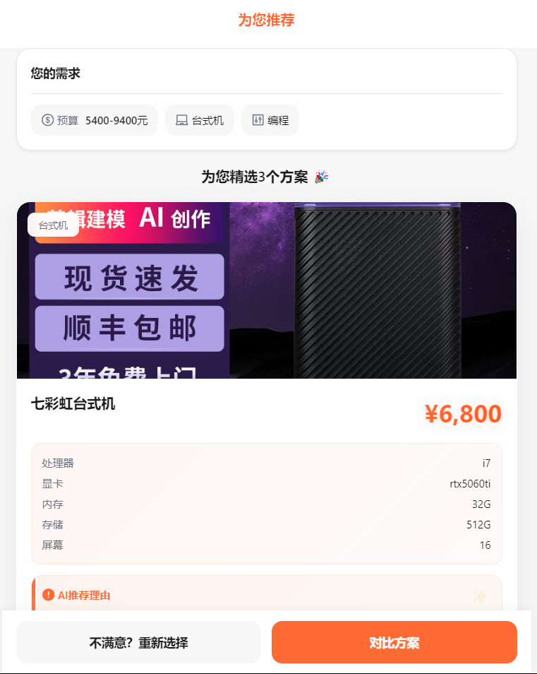</td>
<td width="50%">
<ul>
<li>🎲 智能匹配最佳配置方案</li>
<li>💰 价格透明，一目了然</li>
<li>📋 配置详情清晰展示</li>
<li>🏷️ 支持多种配置类型推荐</li>
</ul>
</td>
</tr>
</table>

<table>
<tr>
<td width="50%">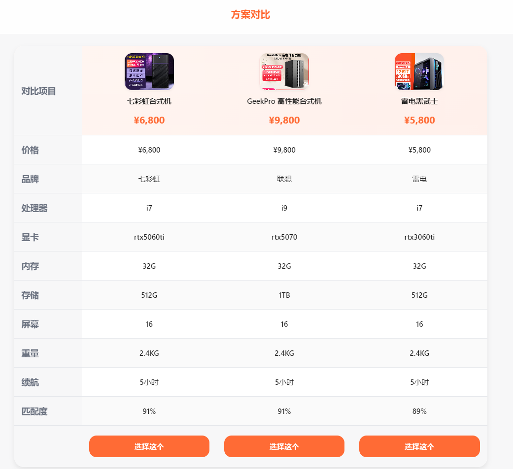</td>
<td width="50%">
<ul>
<li>⚖️ 多方案对比，选择更从容</li>
<li>📊 配置差异直观展示</li>
<li>💡 性价比分析，帮助决策</li>
</ul>
</td>
</tr>
</table>

#### 线索提交 - 留下联系方式

<table>
<tr>
<td width="50%">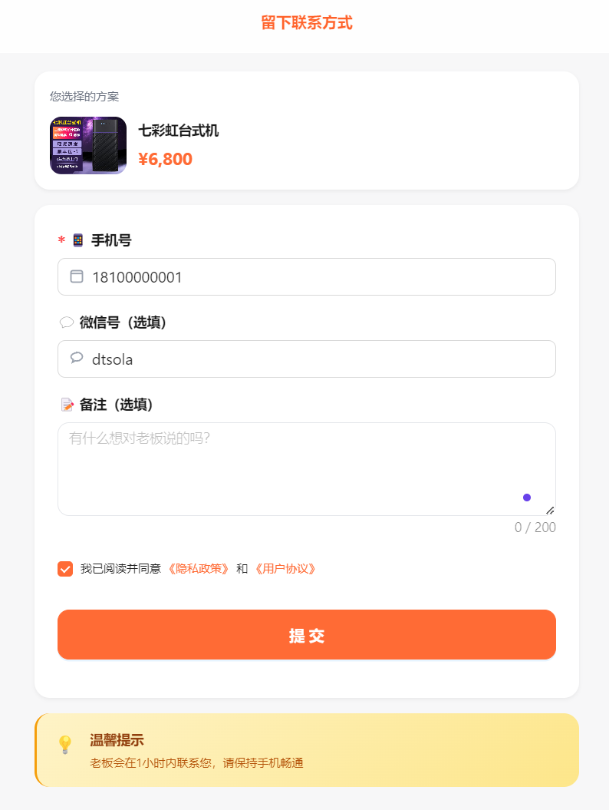</td>
<td width="50%">
<ul>
<li>📱 一键提交联系方式</li>
<li>🔔 商家快速跟进</li>
<li>🛒 促成交易转化</li>
<li>🔐 隐私安全保护</li>
</ul>
</td>
</tr>
</table>

<table>
<tr>
<td width="50%">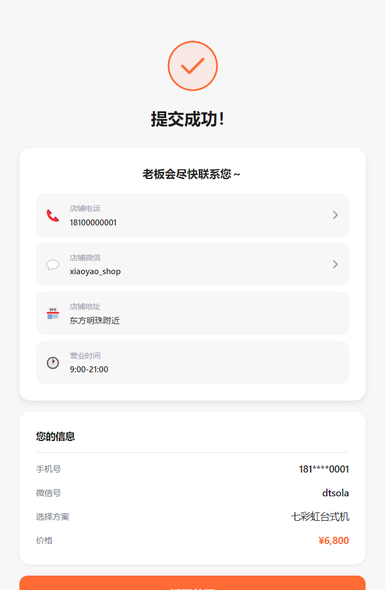</td>
<td width="50%">
<ul>
<li>✅ 提交成功确认</li>
<li>⏰ 商家响应时间提示</li>
<li>🎯 下一步行动指引</li>
</ul>
</td>
</tr>
</table>

---

### B端 - 商家后台，高效管理

#### 登录注册 - 快速入驻

<table>
<tr>
<td width="50%">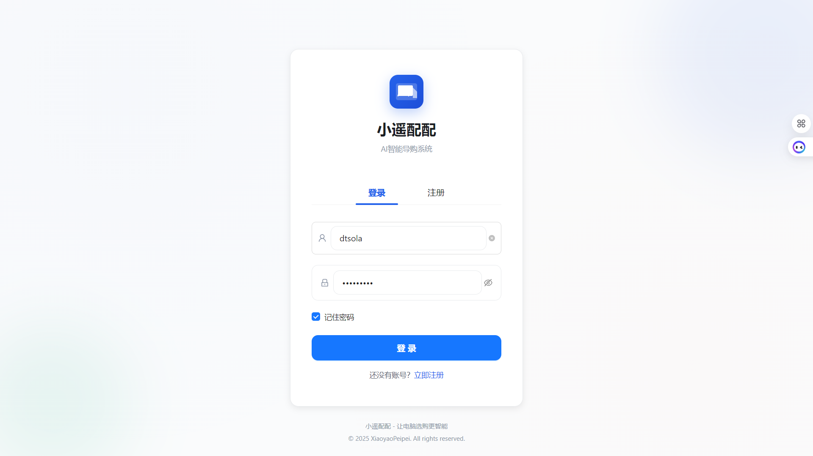</td>
<td width="50%">
<ul>
<li>🔐 简洁安全的登录注册流程</li>
<li>✉️ 邮箱验证，保障账号安全</li>
<li>⚡ 快速上手，无需培训</li>
</ul>
</td>
</tr>
</table>

#### 数据看板 - 经营状况一目了然

<table>
<tr>
<td width="50%">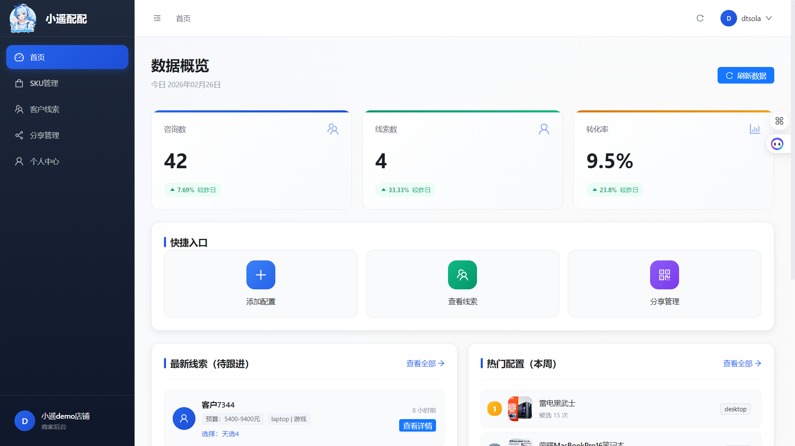</td>
<td width="50%">
<ul>
<li>📊 核心数据一目了然</li>
<li>📈 趋势分析，把握经营状况</li>
<li>🎯 关键指标实时追踪</li>
<li>📉 转化漏斗可视化</li>
</ul>
</td>
</tr>
</table>

#### 配置管理 - SKU 全生命周期管理

<table>
<tr>
<td width="50%">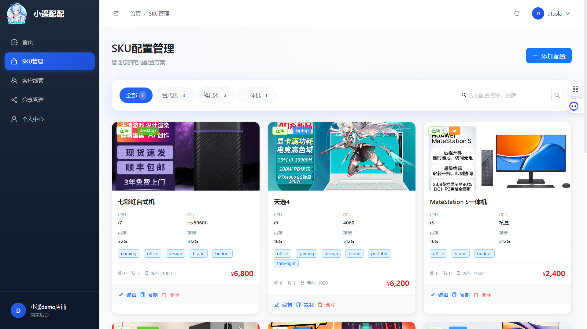</td>
<td width="50%">
<ul>
<li>💼 配置 SKU 统一管理</li>
<li>🔍 快速搜索筛选</li>
<li>🏷️ 自定义分类标签</li>
<li>📊 库存状态实时显示</li>
</ul>
</td>
</tr>
</table>

<table>
<tr>
<td width="50%">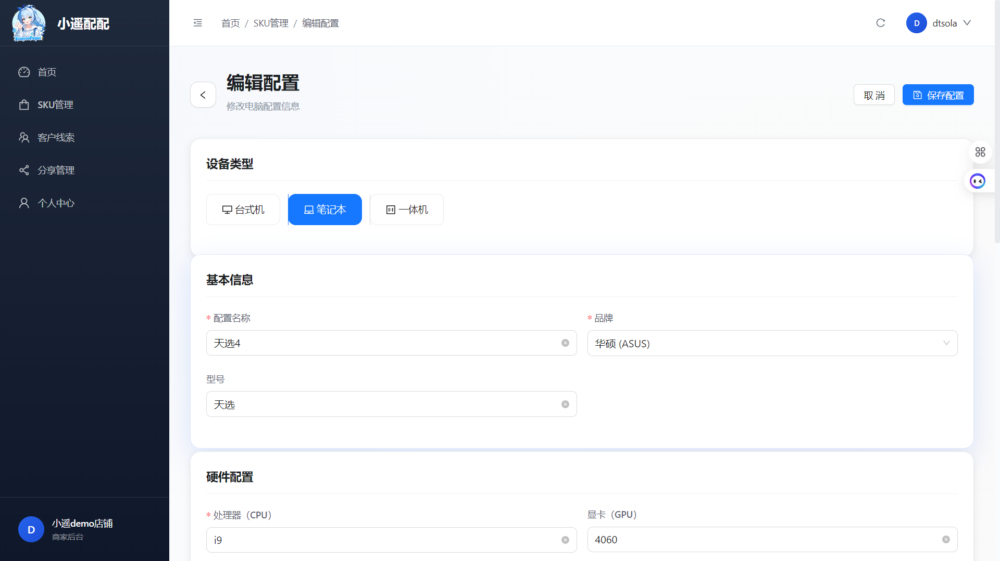</td>
<td width="50%">
<ul>
<li>✏️ 灵活的 SKU 编辑功能</li>
<li>📷 支持图片展示，更直观</li>
<li>📝 详细参数配置</li>
<li>💰 价格设置与调整</li>
</ul>
</td>
</tr>
</table>

#### 线索管理 - 客户线索集中管理

<table>
<tr>
<td width="50%">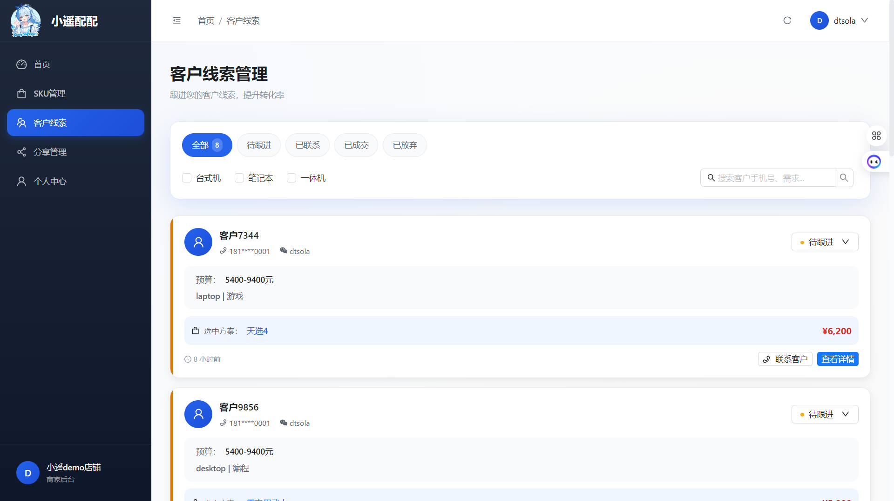</td>
<td width="50%">
<ul>
<li>👥 客户线索集中管理</li>
<li>🔍 多维度筛选查询</li>
<li>📅 时间线视图</li>
<li>🏷️ 状态标签追踪</li>
</ul>
</td>
</tr>
</table>

<table>
<tr>
<td width="50%">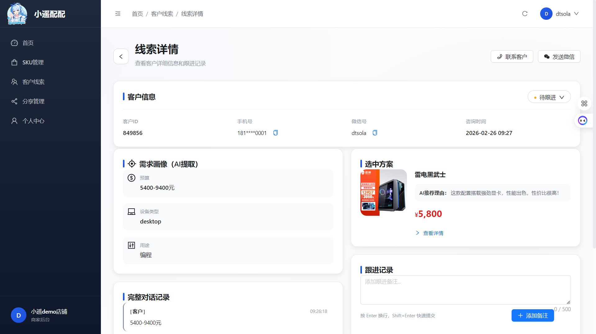</td>
<td width="50%">
<ul>
<li>📋 线索详情完整记录</li>
<li>💬 对话历史回溯</li>
<li>🎯 推荐方案记录</li>
<li>📝 跟进备注功能</li>
</ul>
</td>
</tr>
</table>

#### 分享管理 - 专属推广二维码

<table>
<tr>
<td width="50%">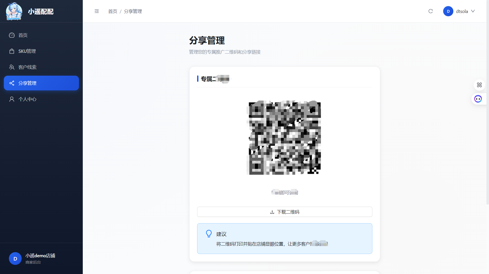</td>
<td width="50%">
<ul>
<li>🎟️ 专属推广二维码</li>
<li>📤 一键分享到微信/朋友圈</li>
<li>🔗 永久链接，随时随地获客</li>
<li>📊 分享数据统计</li>
</ul>
</td>
</tr>
</table>

#### 个人中心 - 会员管理与充值

<table>
<tr>
<td width="50%">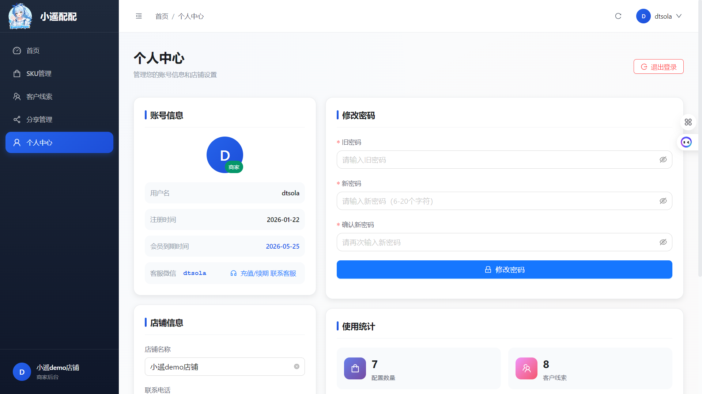</td>
<td width="50%">
<ul>
<li>💳 联系平台充值</li>
<li>⏰ 套餐续期管理</li>
<li>🔔 会员过期前系统提醒</li>
<li>⚙️ 账户设置中心</li>
</ul>
</td>
</tr>
</table>

<table>
<tr>
<td width="50%">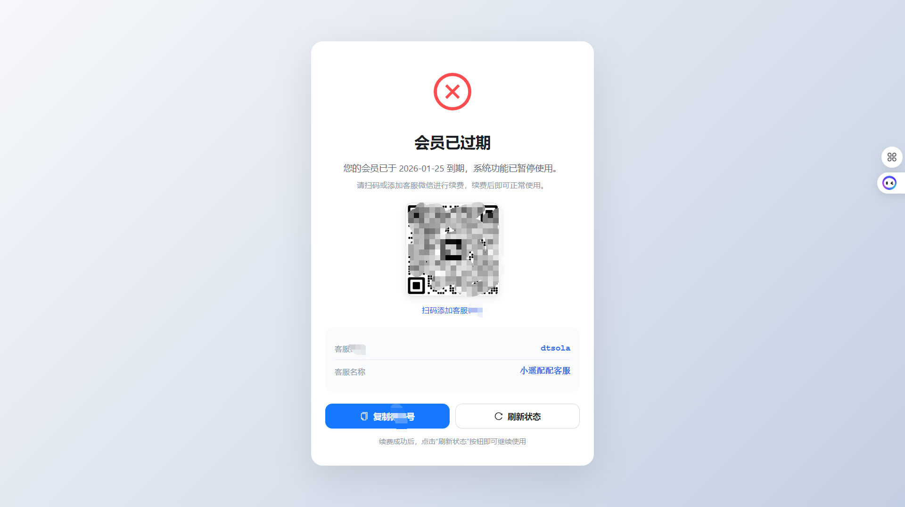</td>
<td width="50%">
<ul>
<li>🔒 登录后自动检查会员状态</li>
<li>⚠️ 过期状态清晰展示</li>
<li>📧 联系续期入口明显</li>
<li>🛡️ 权限控制，保障服务安全</li>
</ul>
</td>
</tr>
</table>

---

## 快速开始

### 环境要求

- **Node.js**: >= 18.0.0
- **Python**: 3.10
- **MySQL**: 8.0
- **Git**: 最新版本

### 方式一：Docker 部署（推荐）

> 详细的部署指南请参考：[Docker部署文档](docs/部署文档/Docker部署文档.md)

**环境变量配置**：

编辑 `docker/.env` 文件，填写以下必需配置：

| 参数 | 获取方式 | 说明 |
|------|---------|------|
| `MYSQL_ROOT_PASSWORD` | 自定义设置<br>生成：`openssl rand -base64 16` | MySQL root 密码，建议使用强密码 |
| `MYSQL_PASSWORD` | 自定义设置<br>生成：`openssl rand -base64 16` | 数据库用户密码，建议使用强密码 |
| `JWT_SECRET` | 自定义设置<br>生成：`openssl rand -base64 32` | JWT 密钥，必须是随机字符串（32位以上） |
| `QWEN_API_KEY` | [阿里云百炼平台](https://bailian.console.aliyun.com/)<br>开通服务后创建 API-KEY | 通义千问 API 密钥 |
| `OSS_ACCESS_KEY_ID` | [阿里云 OSS 控制台](https://oss.console.aliyun.com/)<br>创建 AccessKey 后获取 | OSS 访问密钥 ID |
| `OSS_ACCESS_KEY_SECRET` | [阿里云 OSS 控制台](https://oss.console.aliyun.com/)<br>创建 AccessKey 后获取 | OSS 访问密钥 Secret |
| `OSS_BUCKET` | [阿里云 OSS 控制台](https://oss.console.aliyun.com/)<br>创建 Bucket 后复制名称 | OSS 存储桶名称 |
| `OSS_ENDPOINT` | 根据区域选择<br>• 上海：`oss-cn-shanghai.aliyuncs.com`<br>• 杭州：`oss-cn-hangzhou.aliyuncs.com`<br>• 北京：`oss-cn-beijing.aliyuncs.com` | OSS 终端节点 |
| `OSS_HOST` | 无自定义域名：`https://{bucket}.{endpoint}`<br>有自定义域名：填写绑定的域名 | OSS 文件访问地址 |
| `AES_KEY` | 自定义设置<br>生成：`openssl rand -base64 24 \| head -c 32` | AES 加密密钥，必须是 32 位字符串 |
| `MEMBERSHIP_DEFAULT_DAYS` | 自定义设置，默认 `7` | 会员默认天数（注册时赠送） |
| `MEMBERSHIP_RENEWAL_THRESHOLD` | 自定义设置，默认 `3` | 会员续期提醒阈值（天） |

**快速生成随机密钥**：

```bash
# 生成 JWT_SECRET（示例）
openssl rand -base64 32

# 生成 AES_KEY（必须是32位）
openssl rand -base64 24 | head -c 32
```

**一键启动所有服务**：

```bash
# 1. 配置环境变量
cd docker
# 编辑 .env 文件，填写真实配置

# 2. 启动所有服务（数据库迁移自动运行）
docker-compose up -d

# 3. 查看服务状态
docker-compose ps
```

**本地访问地址**：
- C端前端：http://localhost
- B端前端：http://localhost/mer
- 后端 API：http://localhost/api

**优势**：
- 🚀 一键启动，无需手动配置
- 📦 环境隔离，不污染本地系统
- 🔄 自动运行数据库迁移
- 🛠️ 开发、测试、生产环境一致

---

### 方式二：开发者本地开发

#### 后端启动

```bash
# 1. 进入后端目录
cd xiaoyaopeipei-user-merchant-backend

# 2. 创建虚拟环境（Windows）
py -3.10 -m venv venv
venv\Scripts\activate

# 3. 安装依赖
pip install -r requirements.txt

# 4. 配置环境变量
cp .env.example .env
# 编辑 .env 文件，填写真实配置

# 5. 数据库迁移
alembic upgrade head

# 6. 启动服务
uvicorn app.main:app --reload --port 8001
```

后端运行在：http://localhost:8001
API文档：http://localhost:8001/docs

#### C端前端启动

```bash
# 1. 进入C端前端目录
cd xiaoyaopeipei-user-frontend

# 2. 安装依赖
pnpm install

# 3. 启动开发服务器
pnpm dev
```

C端运行在：http://localhost:3000

#### B端前端启动

```bash
# 1. 进入B端前端目录
cd xiaoyaopeipei-mer-frontend

# 2. 安装依赖
pnpm install

# 3. 启动开发服务器
pnpm dev
```

B端运行在：http://localhost:3001

---

### 方式三：生产环境部署

> 详细的部署指南请参考：[部署文档](docs/部署文档.md)

**部署架构**：
- 云服务器：阿里云ECS 2核4G
- Web服务器：Nginx（反向代理 + 静态资源服务）
- 进程管理：Supervisor

**域名规划**：

| 项目 | 域名 |
|------|------|
| **C端** | `user.example.com` |
| **B端** | `mer.example.com` |
| **API** | `api.example.com` |

---

## 使用说明

### 商家使用流程（B端）

1. **注册账号**：访问 B 端，完成邮箱注册
2. **配置管理**：添加电脑配置 SKU，设置价格和分类
3. **生成二维码**：获取专属推广二维码
4. **分享推广**：将二维码分享给潜在客户
5. **查看线索**：实时接收客户线索，快速跟进成交
6. **数据统计**：查看经营数据，优化营销策略

### 客户使用流程（C端）

1. **扫码访问**：扫描商家专属二维码进入对话页面
2. **AI 对话**：自然语言表达电脑需求
3. **获取推荐**：AI 智能匹配最佳配置方案
4. **对比选择**：查看多个推荐方案，对比选择
5. **提交线索**：留下联系方式，等待商家联系

---

## 技术栈

### 后端

| 技术 | 版本 | 说明 |
|------|------|------|
| Python | 3.10+ | 后端开发语言 |
| FastAPI | 0.109+ | 高性能 Web 框架 |
| SQLAlchemy | 2.0+ | ORM 框架 |
| Alembic | Latest | 数据库迁移工具 |
| Pydantic | 2.x | 数据验证 |
| Loguru | 0.7+ | 日志管理 |
| LangChain | 0.1+ | AI 智能体框架 |
| 通义千问 | qwen-plus | 大语言模型 |
| MySQL | 8.0+ | 关系型数据库 |
| 阿里云OSS | - | 文件存储 |
| JWT | - | 用户认证 |

### 前端（C端 + B端）

| 技术 | 版本 | 说明 |
|------|------|------|
| Vue | 3.4+ | 渐进式前端框架 |
| Vite | 5.0+ | 下一代构建工具 |
| TypeScript | 5.0+ | 类型安全的 JavaScript |
| Ant Design Vue | 4.x | 企业级 UI 组件库 |
| Vue Router | 4.2+ | 官方路由管理 |
| Pinia | 2.1+ | 新一代状态管理 |
| Axios | Latest | HTTP 客户端 |
| ECharts | 5.4+ | 数据可视化（B端） |

### 部署

| 技术 | 说明 |
|------|------|
| Nginx | Web 服务器 / 反向代理 |
| Supervisor | 进程管理 |
| Docker | 容器化部署（可选） |

---

## 项目结构

```
xiaoyaopeipei/
├── xiaoyaopeipei-user-frontend/         # C端前端项目（Vue 3）
│   ├── src/
│   │   ├── api/                         # API 客户端
│   │   ├── views/                       # 页面组件
│   │   ├── components/                  # 公共组件
│   │   ├── stores/                      # 状态管理（Pinia）
│   │   └── utils/                       # 工具函数
│   ├── package.json
│   └── vite.config.ts
│
├── xiaoyaopeipei-mer-frontend/          # B端前端项目（Vue 3）
│   ├── src/
│   │   ├── api/
│   │   ├── views/
│   │   ├── components/
│   │   ├── stores/
│   │   └── utils/
│   ├── package.json
│   └── vite.config.ts
│
├── xiaoyaopeipei-user-merchant-backend/ # 后端项目（FastAPI）
│   ├── app/
│   │   ├── api/                         # API 路由层
│   │   │   ├── user/                    # C端接口
│   │   │   └── mer/                     # B端接口
│   │   ├── core/                        # 核心配置
│   │   ├── models/                      # SQLAlchemy ORM 模型
│   │   ├── schemas/                     # Pydantic 数据验证
│   │   ├── services/                    # 业务逻辑层
│   │   ├── utils/                       # 工具函数
│   │   └── middleware/                  # 中间件
│   ├── alembic/                         # 数据库迁移
│   ├── requirements.txt
│   └── .env.example
│
├── docs/                                # 文档目录
│   ├── 00-mrd.md                        # 市场需求文档
│   ├── 01-prd.md                        # 产品需求文档
│   ├── 03-技术方案.md                    # 技术方案
│   ├── 代码架构.md                       # 代码架构
│   ├── 数据库文档.md                     # 数据库设计
│   ├── 接口文档.md                       # API接口文档
│   ├── 部署文档.md                       # 部署指南
│   └── 产品文档/
│       ├── logos/                       # 品牌素材
│       └── 产品截图/                    # 功能截图
│
└── README.md                            # 本文档
```

---

## 文档索引

| 文档名称 | 路径 | 描述 |
|---------|------|------|
| **MRD文档** | [docs/00-mrd.md](docs/00-mrd.md) | 精益市场需求文档 |
| **PRD文档** | [docs/01-prd.md](docs/01-prd.md) | 产品需求文档 |
| **技术方案** | [docs/03-技术方案.md](docs/03-技术方案.md) | 技术架构设计方案 |
| **代码架构** | [docs/代码架构.md](docs/代码架构.md) | 完整项目代码结构说明 |
| **接口文档** | [docs/接口文档.md](docs/接口文档.md) | RESTful API接口设计文档 |
| **数据库文档** | [docs/数据库文档.md](docs/数据库文档.md) | 数据库设计文档 |
| **部署文档** | [docs/部署文档.md](docs/部署文档.md) | 生产环境部署指南 |

---

## 核心功能

### C端（客户端）

- **AI 智能对话**：基于 LangChain + 通义千问的自然语言交互
- **意图识别**：自动识别客户需求类型（办公、游戏、设计等）
- **配置推荐**：根据需求智能匹配最佳配置方案
- **方案对比**：多方案对比展示，帮助客户决策
- **线索提交**：一键提交联系方式，促成交易

### B端（商家端）

- **商家认证**：邮箱注册登录，JWT Token 认证
- **配置管理**：增删改查电脑配置 SKU
- **线索管理**：查看客户线索列表和详情
- **数据统计**：访问量、线索量、转化率等数据看板
- **分享管理**：生成专属推广二维码，追踪来源
- **个人中心**：账户管理、联系平台充值、套餐续期

---

## 开发规范

### 代码规范

- **Python**: 遵循 [PEP 8](https://pep8.org/) 规范，使用 black + isort 格式化
- **TypeScript**: 遵循 ESLint + Prettier 规范
- **命名规范**：
  - Python: `snake_case`（函数/变量）、`PascalCase`（类）
  - TypeScript: `camelCase`（变量/函数）、`PascalCase`（类/组件）

### Git 提交规范

```
<type>(<scope>): <subject>

# Type 类型
feat: 新功能
fix: bug修复
docs: 文档更新
style: 代码格式调整
refactor: 重构
test: 测试相关
chore: 构建/工具变动
```

详细规范请参阅 [CLAUDE.md](.claude/CLAUDE.md)

---

## 贡献指南

欢迎贡献代码、报告问题或提出建议！

### 开发流程

1. Fork 本仓库
2. 创建功能分支 (`git checkout -b feature/AmazingFeature`)
3. 提交更改 (`git commit -m 'feat: 添加某个功能'`)
4. 推送到分支 (`git push origin feature/AmazingFeature`)
5. 创建 Pull Request

---

## 常见问题

### Q: 支持哪些大模型？

A: 目前使用阿里云通义千问 (qwen-plus)，后续可扩展支持其他模型。

### Q: 数据如何存储？

A: 使用 MySQL 8.0 存储结构化数据，阿里云 OSS 存储图片等文件。

### Q: 如何自定义 AI 对话提示词？

A: 在后端 `app/services/ai_service.py` 中修改 LangChain 提示词模板。

### Q: 支持移动端吗？

A: 支持。前端采用响应式设计，可在手机浏览器上正常使用。

### Q: 如何充值和续期？

A: 联系平台方进行充值，登录 B 端个人中心可查看会员到期时间并进行续期。系统会在会员过期前发送提醒通知。

### Q: 会员过期后怎么办？

A: 登录后会自动检查会员状态，如已过期会提示联系续期。续期后即可正常使用全部功能。

---


## 许可证

本项目采用 [MIT 许可证](LICENSE)

---

## 联系方式

- **项目主页**: [GitHub](https://github.com/dtsola/xiaoyaopeipei)
- **问题反馈**: [Issues](https://github.com/dtsola/xiaoyaopeipei/issues)
- **个人站点**: [https://www.dtsola.com](https://www.dtsola.com)
- **微信**: dtsola（与我建联，备注：github）

---

**小遥配配：AI 对话式电脑导购，帮你 24 小时接单**

**Made with ❤️ by Xiaoyao Team**
