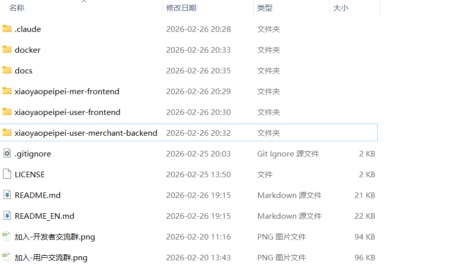
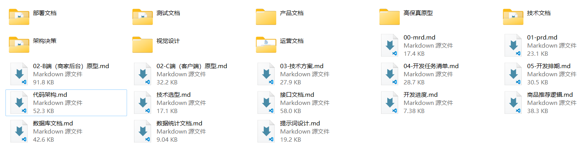
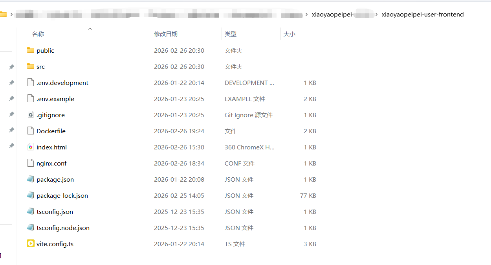
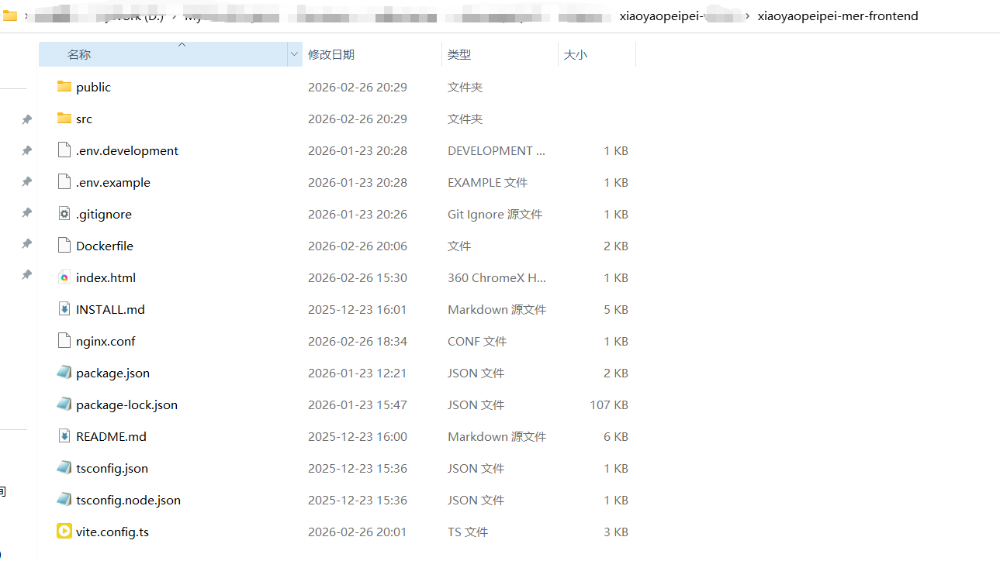
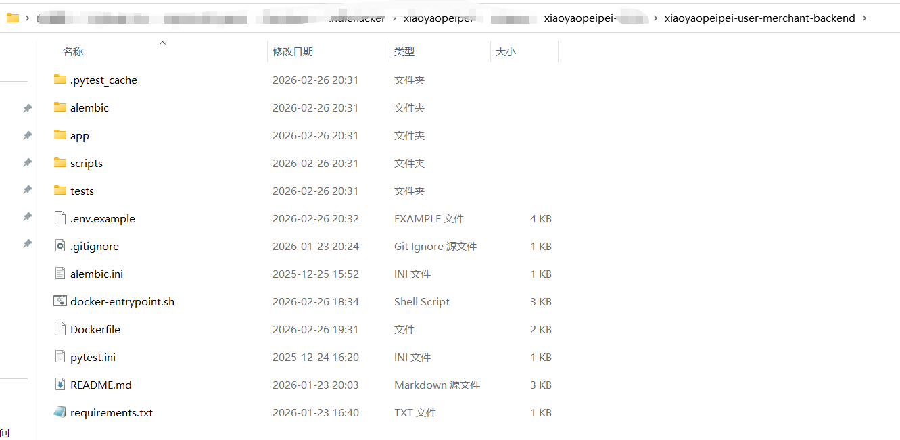
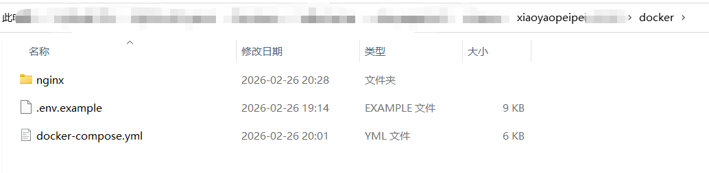

# 小遥配配

> AI 对话式电脑导购，帮你 24 小时接单

[](https://opensource.org/licenses/MIT)
[](https://www.python.org/)
[](https://vuejs.org/)
[](https://fastapi.tiangolo.com/)

简体中文

<p align="center">
  
</p>

---

## 源码获取

<p align="center">
  
</p>

<p align="center">
  <b>源代码定价：人民币 199元</b>
</p>

<p align="center">
  联系微信：dtsola（备注：小遥配配源码）
</p>

<p align="center">
  
</p>

<p align="center">
  <small>扫码添加微信，获取完整源代码</small>
</p>

### 包含内容

购买源代码，您将获得：

- **完整项目源代码** - C端前端 + B端前端 + 后端（前后端分离架构）
- **完整项目文档** - 市场需求、产品设计、技术方案、接口文档、部署文档等全链路文档
- **Docker部署方案** - 一键启动，快速上线
- **MIT开源许可** - 可自由修改、商用，无需保留作者署名

### 增值服务（可选）

| 服务 | 价格 | 服务内容 |
|------|------|---------|
| **技术咨询** | 100元/次 | 解答1-2个具体技术问题（文字/语音回复） |
| **远程部署** | 300元 | 远程登录服务器，完成部署并验证运行（1小时内） |
| **定制开发** | 200元/小时 | 功能定制/界面修改/业务逻辑调整 |

> 💡 **说明**：源码套餐不含技术支持和部署服务，购买后可根据需要单独购买增值服务。

---

## 简介

小遥配配是一个 **AI 对话式电脑导购助手**，为电脑店老板提供智能客户需求收集和配置推荐服务的 SaaS 平台，通过 AI 对话方式收集客户需求，智能推荐合适的电脑配置方案。

**核心特点**：
- 🤖 **AI 智能对话** - 自然语言交互，自动识别客户需求意图
- 🎯 **精准配置推荐** - 基于需求自动匹配最佳电脑配置方案
- 📊 **客户线索管理** - 自动收集客户联系方式，不错过任何一个潜在客户
- 📈 **数据统计分析** - 实时查看营销数据和转化效果，优化经营决策
- 🚀 **快速部署** - 前后端分离架构，易于部署和扩展
- 💻 **双端支持** - B 端商家后台 + C 端客户对话界面
- 📱 **响应式设计** - 支持桌面端和移动端访问

---

## 项目源码预览

### 项目根目录结构

<table>
<tr>
<td width="50%"></td>
<td width="50%">
<ul>
<li>📁 前后端分离架构</li>
<li>📁 完整的项目文档体系</li>
<li>🐳 Docker 一键部署支持</li>
<li>📦 模块化代码组织</li>
</ul>
</td>
</tr>
</table>

### 完整项目文档体系

<table>
<tr>
<td width="50%"></td>
<td width="50%">
<ul>
<li>📊 市场需求文档 (MRD)</li>
<li>📱 产品需求文档 (PRD)</li>
<li>🎨 UI/UX 设计文档</li>
<li>💻 技术方案文档</li>
<li>🧪 测试文档</li>
<li>📦 部署文档</li>
<li>🚀 运营文档</li>
</ul>
</td>
</tr>
</table>

### C端用户端源代码

<table>
<tr>
<td width="50%"></td>
<td width="50%">
<ul>
<li>Vue 3 + TypeScript</li>
<li>Vite 构建工具</li>
<li>AI 对话交互</li>
<li>配置推荐展示</li>
<li>线索提交功能</li>
</ul>
</td>
</tr>
</table>

### B端商户端源代码

<table>
<tr>
<td width="50%"></td>
<td width="50%">
<ul>
<li>Vue 3 + Ant Design Vue</li>
<li>数据看板展示</li>
<li>配置 SKU 管理</li>
<li>客户线索管理</li>
<li>ECharts 数据可视化</li>
</ul>
</td>
</tr>
</table>

### 后端源代码

<table>
<tr>
<td width="50%"></td>
<td width="50%">
<ul>
<li>FastAPI 高性能框架</li>
<li>SQLAlchemy ORM</li>
<li>LangChain AI 框架</li>
<li>通义千问大模型集成</li>
<li>JWT 身份认证</li>
</ul>
</td>
</tr>
</table>

### Docker 一键部署

<table>
<tr>
<td width="50%"></td>
<td width="50%">
<ul>
<li>🐳 Docker Compose 编排</li>
<li>🗄️ MySQL 数据库</li>
<li>🔧 自动数据库迁移</li>
<li>🚀 一键启动所有服务</li>
<li>📦 环境隔离部署</li>
</ul>
</td>
</tr>
</table>

---

## 功能预览

### C端 - 智能对话，获取推荐

#### 对话首页 - 自然语言交互

<table>
<tr>
<td width="50%"></td>
<td width="50%">
<ul>
<li>🎯 自然语言对话，轻松表达需求</li>
<li>🤖 AI 自动识别需求意图</li>
<li>⚡ 实时响应，流畅交互体验</li>
<li>💬 支持多轮对话，逐步细化需求</li>
</ul>
</td>
</tr>
</table>

#### 配置推荐 - 智能匹配方案

<table>
<tr>
<td width="50%"></td>
<td width="50%">
<ul>
<li>🎲 智能匹配最佳配置方案</li>
<li>💰 价格透明，一目了然</li>
<li>📋 配置详情清晰展示</li>
<li>🏷️ 支持多种配置类型推荐</li>
</ul>
</td>
</tr>
</table>

<table>
<tr>
<td width="50%"></td>
<td width="50%">
<ul>
<li>⚖️ 多方案对比，选择更从容</li>
<li>📊 配置差异直观展示</li>
<li>💡 性价比分析，帮助决策</li>
</ul>
</td>
</tr>
</table>

#### 线索提交 - 留下联系方式

<table>
<tr>
<td width="50%"></td>
<td width="50%">
<ul>
<li>📱 一键提交联系方式</li>
<li>🔔 商家快速跟进</li>
<li>🛒 促成交易转化</li>
<li>🔐 隐私安全保护</li>
</ul>
</td>
</tr>
</table>

<table>
<tr>
<td width="50%"></td>
<td width="50%">
<ul>
<li>✅ 提交成功确认</li>
<li>⏰ 商家响应时间提示</li>
<li>🎯 下一步行动指引</li>
</ul>
</td>
</tr>
</table>

---

### B端 - 商家后台，高效管理

#### 登录注册 - 快速入驻

<table>
<tr>
<td width="50%"></td>
<td width="50%">
<ul>
<li>🔐 简洁安全的登录注册流程</li>
<li>✉️ 邮箱验证，保障账号安全</li>
<li>⚡ 快速上手，无需培训</li>
</ul>
</td>
</tr>
</table>

#### 数据看板 - 经营状况一目了然

<table>
<tr>
<td width="50%"></td>
<td width="50%">
<ul>
<li>📊 核心数据一目了然</li>
<li>📈 趋势分析，把握经营状况</li>
<li>🎯 关键指标实时追踪</li>
<li>📉 转化漏斗可视化</li>
</ul>
</td>
</tr>
</table>

#### 配置管理 - SKU 全生命周期管理

<table>
<tr>
<td width="50%"></td>
<td width="50%">
<ul>
<li>💼 配置 SKU 统一管理</li>
<li>🔍 快速搜索筛选</li>
<li>🏷️ 自定义分类标签</li>
<li>📊 库存状态实时显示</li>
</ul>
</td>
</tr>
</table>

<table>
<tr>
<td width="50%"></td>
<td width="50%">
<ul>
<li>✏️ 灵活的 SKU 编辑功能</li>
<li>📷 支持图片展示，更直观</li>
<li>📝 详细参数配置</li>
<li>💰 价格设置与调整</li>
</ul>
</td>
</tr>
</table>

#### 线索管理 - 客户线索集中管理

<table>
<tr>
<td width="50%"></td>
<td width="50%">
<ul>
<li>👥 客户线索集中管理</li>
<li>🔍 多维度筛选查询</li>
<li>📅 时间线视图</li>
<li>🏷️ 状态标签追踪</li>
</ul>
</td>
</tr>
</table>

<table>
<tr>
<td width="50%"></td>
<td width="50%">
<ul>
<li>📋 线索详情完整记录</li>
<li>💬 对话历史回溯</li>
<li>🎯 推荐方案记录</li>
<li>📝 跟进备注功能</li>
</ul>
</td>
</tr>
</table>

#### 分享管理 - 专属推广二维码

<table>
<tr>
<td width="50%"></td>
<td width="50%">
<ul>
<li>🎟️ 专属推广二维码</li>
<li>📤 一键分享到微信/朋友圈</li>
<li>🔗 永久链接，随时随地获客</li>
<li>📊 分享数据统计</li>
</ul>
</td>
</tr>
</table>

#### 个人中心 - 会员管理与充值

<table>
<tr>
<td width="50%"></td>
<td width="50%">
<ul>
<li>💳 联系平台充值</li>
<li>⏰ 套餐续期管理</li>
<li>🔔 会员过期前系统提醒</li>
<li>⚙️ 账户设置中心</li>
</ul>
</td>
</tr>
</table>

<table>
<tr>
<td width="50%"></td>
<td width="50%">
<ul>
<li>🔒 登录后自动检查会员状态</li>
<li>⚠️ 过期状态清晰展示</li>
<li>📧 联系续期入口明显</li>
<li>🛡️ 权限控制，保障服务安全</li>
</ul>
</td>
</tr>
</table>

---

## 技术栈

### 后端

| 技术 | 版本 | 说明 |
|------|------|------|
| Python | 3.10+ | 后端开发语言 |
| FastAPI | 0.109+ | 高性能 Web 框架 |
| SQLAlchemy | 2.0+ | ORM 框架 |
| Alembic | Latest | 数据库迁移工具 |
| Pydantic | 2.x | 数据验证 |
| Loguru | 0.7+ | 日志管理 |
| LangChain | 0.1+ | AI 智能体框架 |
| 通义千问 | qwen-plus | 大语言模型 |
| MySQL | 8.0+ | 关系型数据库 |
| 阿里云OSS | - | 文件存储 |
| JWT | - | 用户认证 |

### 前端（C端 + B端）

| 技术 | 版本 | 说明 |
|------|------|------|
| Vue | 3.4+ | 渐进式前端框架 |
| Vite | 5.0+ | 下一代构建工具 |
| TypeScript | 5.0+ | 类型安全的 JavaScript |
| Ant Design Vue | 4.x | 企业级 UI 组件库 |
| Vue Router | 4.2+ | 官方路由管理 |
| Pinia | 2.1+ | 新一代状态管理 |
| Axios | Latest | HTTP 客户端 |
| ECharts | 5.4+ | 数据可视化（B端） |

### 部署

| 技术 | 说明 |
|------|------|
| Nginx | Web 服务器 / 反向代理 |
| Supervisor | 进程管理 |
| Docker | 容器化部署（可选） |

---

## 项目结构

```
xiaoyaopeipei/
├── xiaoyaopeipei-user-frontend/         # C端前端项目（Vue 3）
│   ├── src/
│   │   ├── api/                         # API 客户端
│   │   ├── views/                       # 页面组件
│   │   ├── components/                  # 公共组件
│   │   ├── stores/                      # 状态管理（Pinia）
│   │   └── utils/                       # 工具函数
│   ├── package.json
│   └── vite.config.ts
│
├── xiaoyaopeipei-mer-frontend/          # B端前端项目（Vue 3）
│   ├── src/
│   │   ├── api/
│   │   ├── views/
│   │   ├── components/
│   │   ├── stores/
│   │   └── utils/
│   ├── package.json
│   └── vite.config.ts
│
├── xiaoyaopeipei-user-merchant-backend/ # 后端项目（FastAPI）
│   ├── app/
│   │   ├── api/                         # API 路由层
│   │   │   ├── user/                    # C端接口
│   │   │   └── mer/                     # B端接口
│   │   ├── core/                        # 核心配置
│   │   ├── models/                      # SQLAlchemy ORM 模型
│   │   ├── schemas/                     # Pydantic 数据验证
│   │   ├── services/                    # 业务逻辑层
│   │   ├── utils/                       # 工具函数
│   │   └── middleware/                  # 中间件
│   ├── alembic/                         # 数据库迁移
│   ├── requirements.txt
│   └── .env.example
│
├── docker/                               # Docker 部署配置
│   ├── docker-compose.yml
│   └── .env
│
├── docs/                                # 文档目录
│   ├── 00-mrd.md                        # 市场需求文档
│   ├── 01-prd.md                        # 产品需求文档
│   ├── 03-技术方案.md                    # 技术方案
│   ├── 代码架构.md                       # 代码架构
│   ├── 数据库文档.md                     # 数据库设计
│   ├── 接口文档.md                       # API接口文档
│   ├── 部署文档/                         # 部署指南
│   │   └── Docker部署文档.md
│   └── 产品文档/
│       ├── logos/                       # 品牌素材
│       ├── 产品截图/                    # 功能截图
│       └── 项目截图/                    # 源代码截图
│
└── README.md                            # 本文档
```

---

## 许可证

本项目采用 [MIT 许可证](LICENSE)

购买源代码后，您可以：
- ✅ 自由使用、修改、分发
- ✅ 用于商业项目
- ✅ 进行二次开发

---

**小遥配配：AI 对话式电脑导购，帮你 24 小时接单**

**Made with ❤️ by Xiaoyao Team**
